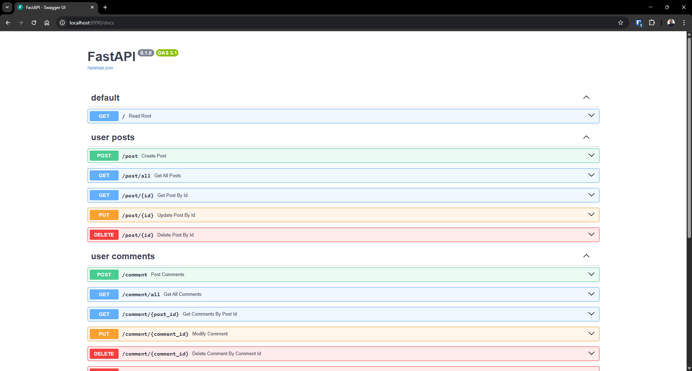
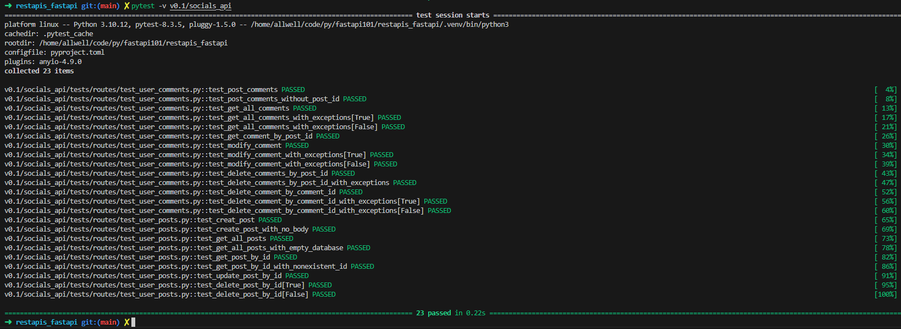
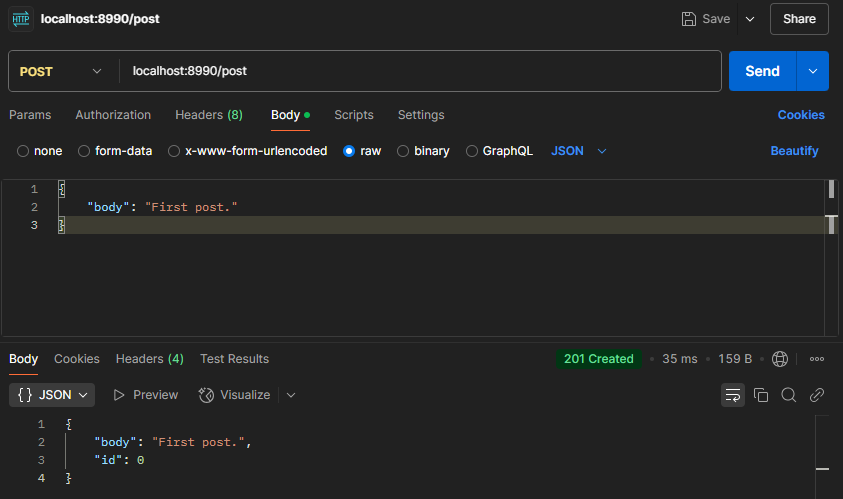
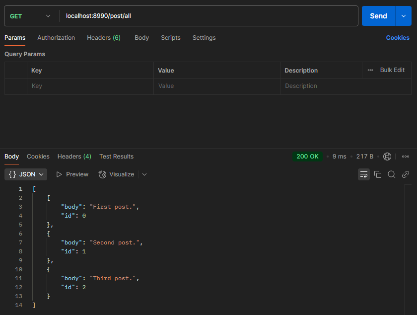
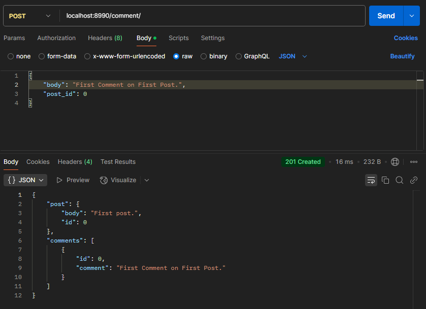
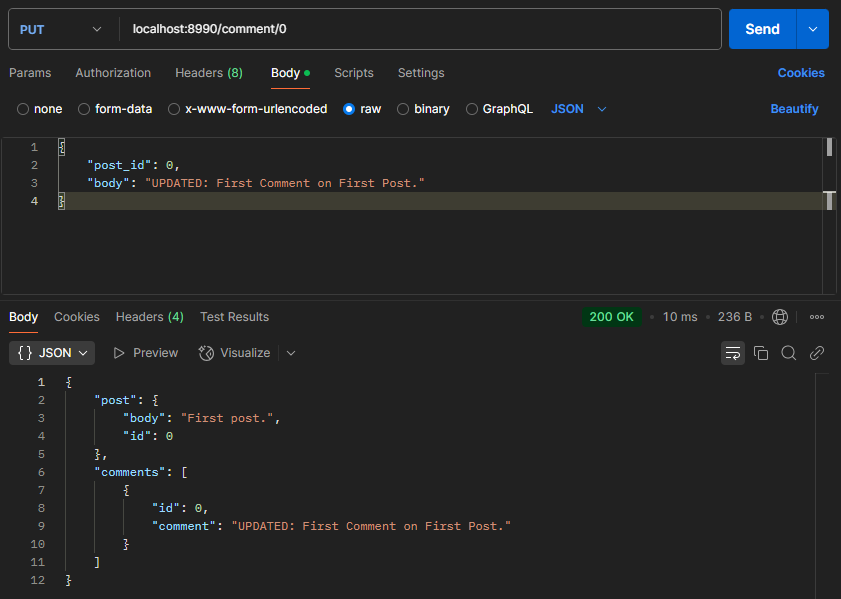
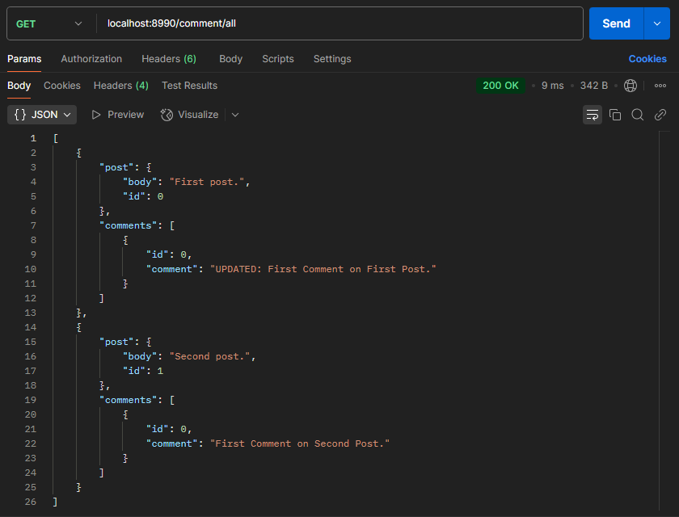

# Building a Minimal Asynchronous Social Media REST API with FastAPI & TDD (Test Driven Development)

*(Updated for v0.1)*

Built a minimal Social Media API with REST architecture as a project to deepen my understanding of FastAPI & Python. `socials_api` is a minimal Social Media API with the following functions:
- User Posts
- User Comments

Using Swagger UI, you can access the API docs at the `/docs` endpoint (as seen below).



## Code Functionality
1. **Dictionary-based Data Storage:** At the moment, the API uses a dictionary object as a make-shift for data storage and retrieval.
2. **Unit Testing:** Alongside manual testing through the API docs via Swagger UI, automatic testing is also implemented using `pytest`.
3. **Deduplication Algorithm for Post & Comment ID Values:** Since data storage is handled by a simple dictionary object, I wrote an algorithm to ensure post and comment id values are not duplicated (as that would not be a natural experience).


## TDD (Test Driven Development)
To ensure TDD (Test Driven Development), I used the popular Python testing framework `pytest` to write FastAPI unit tests for the codebase. All 23 tests pass! You can find tests code in `./tests/` directory.



## Code use
An exhibit of API calls to display what the API can do. Testing using Postman API Client:
1. Create Post



2. Get All Posts



3. Post Comments



4. Modify Comment



5. Get All Comments




## Run code locally...
To run the codebase appropriately locally, read the following instructions:
- Clone/Fork the repo to local.
- Start FastAPI web server:
  ```bash
  cd restapi_fastapi # make sure you are in the project root directory
  uvicorn --app-dir v0.1 socials_api.main:app --reload
  ```
- Connect to web server using a web browser client or Postman API Client. Go to `localhost/docs` or `localhost:8000/docs`.
- Manually test API endpoints. To find available API endpoints, use Swagger UI API docs by visiting `/docs` endpoint on web browser client.
- Run unit tests on codebase (using `pytest`):
  ```bash
  cd restapi_fastapi # make sure you are in the project root directory
  pytest -v v0.1/socials_api
  ```


