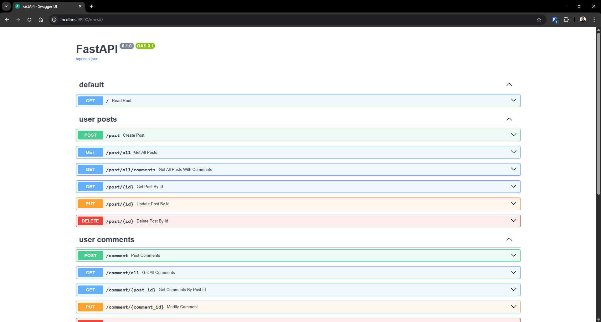
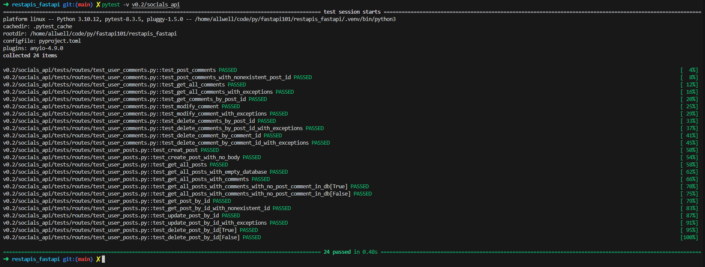
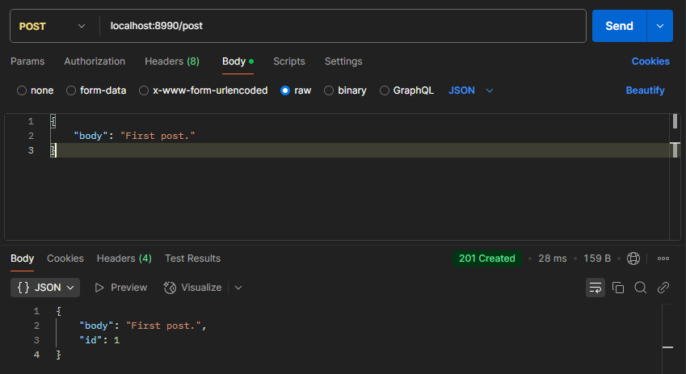
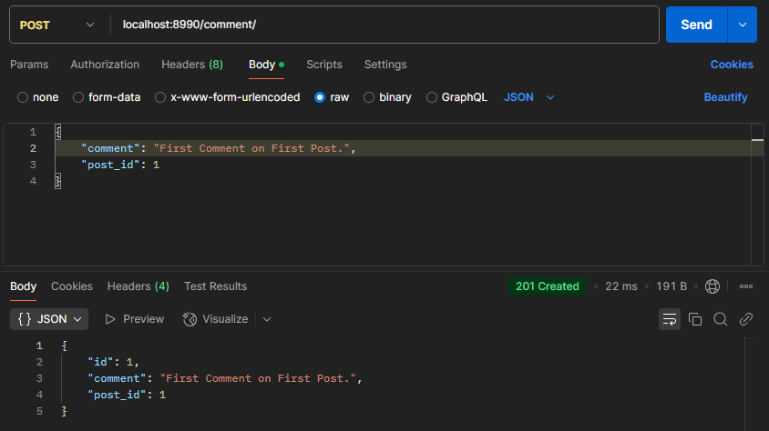
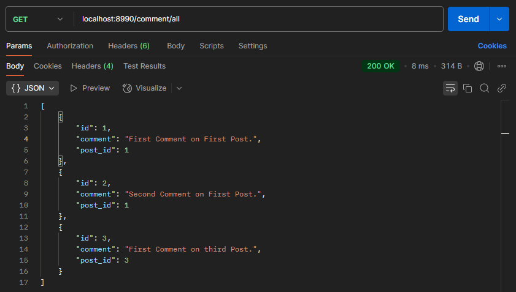
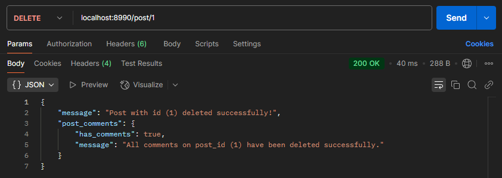

# Building a Minimal Asynchronous Social Media REST API with FastAPI & TDD (Test Driven Development)

*(Updated for v0.2)*

Built a minimal Social Media API with REST architecture as a project to deepen my understanding of FastAPI & Python. `socials_api` is a minimal Social Media API with the following functions:
- User Posts
- User Comments

Using Swagger UI, you can access the API docs at the `/docs` endpoint (as seen below).



## Code Functionality *(Updated in v0.2)*
1. **SQLite SQL Database:** Transitioned from a dictionary-based data storage system to using an SQLite database for persisten data storage and retrieval.
2. **Switch to DB for deduplication of Primary Keys for Post & Comment ID Values:** No need for custom algorithm to keep the ID values deduplicated. Using DB Primary Keys, ID values auto-increment and remain unique.
3. **More Endpoints:** Added "Get Posts With Comments" endpoint and updated the return schema for posts and comments to match their database model.


## TDD (Test Driven Development)
To ensure TDD (Test Driven Development), I used the popular Python testing framework `pytest` to write FastAPI unit tests for the codebase. All 24 tests pass! You can find tests code in `./tests/` directory.



## Code use
An exhibit of API calls to display what the API can do. Testing using Postman API Client:
1. Create Post



2. Post Comments



3. Get All Comments



4. Delete Post By Id




## Run code locally...
To run the codebase appropriately locally, read the following instructions:
- Clone/Fork the repo to local.
- Start FastAPI web server:
  ```bash
  cd restapi_fastapi # make sure you are in the project root directory
  uvicorn --app-dir v0.2 socials_api.main:app --reload
  ```
- Connect to web server using a web browser client or Postman API Client. Go to `localhost/docs` or `localhost:8000/docs`.
- Manually test API endpoints. To find available API endpoints, use Swagger UI API docs by visiting `/docs` endpoint on web browser client.
- Run unit tests on codebase (using `pytest`):
  ```bash
  cd restapi_fastapi # make sure you are in the project root directory
  pytest -v v0.2/socials_api
  ```


